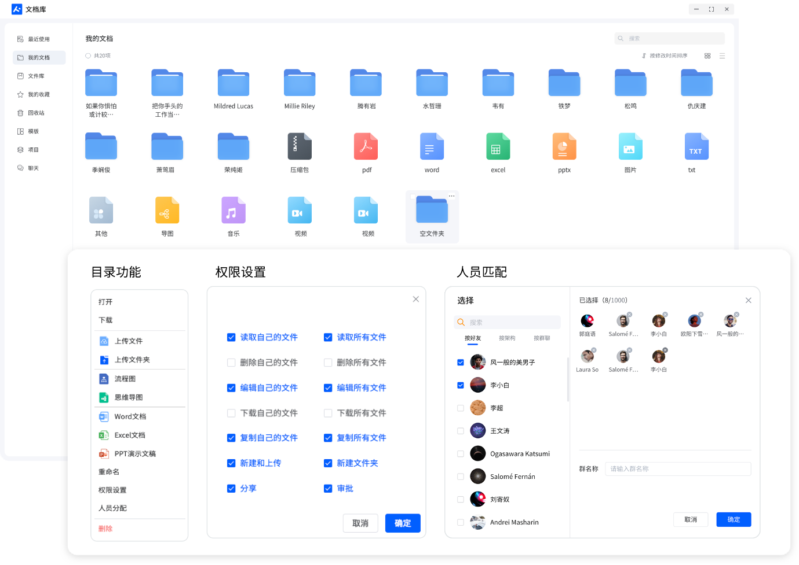
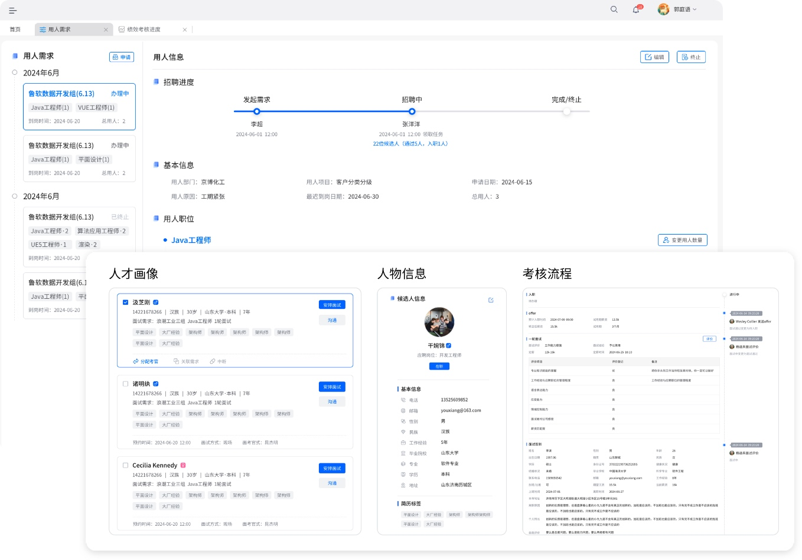

# Fiz-EIM

## 产品概述

Fiz-EIM 作为一款以即时通讯为核心基石的协同办公平台，独具优势。它支持企业进行私有化部署，精准锚定打造企业专属且具备高安全性的通讯枢纽这一目标。

Fiz-EIM 配备了即时通讯领域丰富多样且规范统一的接口，能够无缝对接企业现有的各类业务系统，以极高的效率助力现有业务系统实现业务数据的即时、精准送达，为企业业务的流畅运转按下 “加速键”。在信息安全层面，支持数据加密以及访问权限精细管控，全面保护企业数据资产安全。

## 产品特性

支持私有化部署且支持国产化环境。

支持通讯信息以及关键业务数据加密。

支持与企业现有系统进行对接，加速业务流转

支持企业互联网以及企业内部私有化大模型对接，构建企业AI应用

支持auth2等权限体系对接。

支持手机端与微信小程序以及桌面安装端。

内置项目管理套件项目全生命周期管理。

支持在线office协同编辑。

支持在线绘图（思维导图，流程图等）

提供私有化大模型部署，提供语音转文字，会议报告AI总结。

## 产品能力

1、通讯协同
面向企业即时沟通通讯平台，满足常规IM沟通之外，增加企业办公需要任务、代办、讨论等特有功能。

* 统一通讯，快速找人

* 多端同步，消息必达

* 工作组群，沟通高效

* 服务端存储，记录可查
    
    

    2、文档协同
    企业文档协同管理，支持在线多人编辑office文档，文档好友发送，组群协同编辑，支持文档多级权限管理，提高企业信息安全

* 即时分享，多端同步

* 团队共创，多人协作

* 多策略管控，信息安全

* 跨系统文档协同
    

    3、业务协同
    提供丰富的标准接口与规范，支持企业已有系统对接，打破信息孤岛，实现业务融合，工作入口统一，业务消息即时送达

* 标准开发接口，支持企业第三方系统接入，整合系统功能，赋能业务消息送达，提高生产力

* 现有系统通过标准化的集成解决方案、前端集成方案对接Fiz-EIM

* 工作台模式：实现功能、数据找人，帮助员工聚焦业务
    

4、AI协同
大模型私有化部署，语音转文字，自动生成会议报告，智能化分析，通过简单对话即可对数据进行分析


* 自动识别，智能填写
* 语音识别，智能会议纪要
* 智能报表，智能自助分析
* 智能问答，智能经验库
    


## 丰富的应用

* 项目管理系统
    

* 文档管理系统
    


* 人事管理系统
    


* 薪酬管理系统
    


* 人才库系统
    


* 绩效管理系统
    


* BSP系统
    


* BI分析套件
    


* 低代码平台
    


* 更多应用敬请期待！

 

## 产品介绍

除开源版本外，我方提供了功能完善的专业版以及可提供AI服务的企业定制版本。各版本功能概述如下：

| 功能项            | 描述                                                         | 开源版   | 专业版           | 企业定制版          |
| ----------------- | ------------------------------------------------------------ | -------- | ---------------- | ------------------- |
| IM通讯协同        | 企业内部专属通讯平台，加速企业业务信息智能化流转，全面提升企业信息安全，精细化管理，提升企业经营效益。 | 基础功能 | 标准功能         | 标准功能+定制化服务 |
| 业务协同          | 标准开发接口，支持企业第三方系统接入，整合系统功能，赋能业务消息送达，提高生产力 | 基础功能 | 标准功能         | 标准功能+定制化服务 |
| 文档协同          | 帮助团队高效协同编辑、分享、管理文档，沉淀团队经验，私有化部署策略进一步提高企业文档安全管控，构建新一代生产效率。 | 基础功能 | 标准功能         | 标准功能+定制化服务 |
| AI智能协同        | 私有化AI模型4大应用快速帮助企业完成智能化转变，释放劳动力，提升产能 | ×        | ×                | 定制化服务          |
| 应用-工作台       | 开箱即用的工作台支持自建应用、自建分组、自建组件，为企业成员提供一站式的工作门户 | ×        | 标准功能         | 标准功能+定制化服务 |
| 应用-文档库       | 企业级文档库，支持目录划分，权限分配，支持在线协同编辑，与项目/任务管理，IM聊天文件深度打通。实现了文档全流 | 基础功能 | 标准功能         | 标准功能+定制化服务 |
| 应用-项目管理     | 项目管理包含项目质量控制、日报审核、成员管理、进度管理、风险管理、数据分析。项目生命周期提供不同视角聚焦关注问题，保证项目平稳运行。 | 基础功能 | 标准功能         | 标准功能+定制化服务 |
| 应用-人事管理     | 人事管理包含HR管理、人才管理、考核管理、工资管理等功能，帮助企业提高效率、优化决策、促进公平、节约成本、合规管理，助力员工发展。 | ×        | 标准功能付费下载 | 标准功能+定制化服务 |
| 应用-人工智能     | 私有大模型对话即席分析，自然语言转机器语言，轻松获取业务报表，智能化分析总结。 | ×        | ×                | 定制化服务          |
| 应用中心更多应用  | /                                                            | ×        | 标准功能付费下载 | 标准功能+定制化服务 |
| 中间件-BSP        | 创建或同步现有组织架构，支持HR、OA、CRM、AD、AAD、LDAP、等多分支/多系统的整合，打造一个身份标准，维持统一组织架构，支持集成系统权限适配，快速完成业务消息通信与流转。 | 基础功能 | 标准功能         | 标准功能+定制化服务 |
| 中间件-BI可视化   | 平台内置数飞BI智能智能分析引擎，对业务数据可实现快速可视化设计与分析 | ×        | 标准功能付费下载 | 标准功能+定制化服务 |
| 中间件-BPM        | 结合自主研发的业务流程引擎，实现流程的定义、发布及应用一体化服务 | ×        | 标准功能付费下载 | 标准功能+定制化服务 |
| 中间件-大屏设计器 | 在线设计企业专属大屏，内置丰富大屏组件，无需编码，在线拖拽可完成大屏定义，内置70+大屏模板，可快速引入模板大屏进行二次设计 | ×        | 标准功能付费下载 | 标准功能+定制化服务 |

## 开源版本功能列表

Fiz-EIM开源版为50人左右的小型团队提供便捷的团队协作工具

| 项目        | 内容                                                         | 开源版     |
| ----------- | ------------------------------------------------------------ | ---------- |
| IM          | 群聊频道                                                     | √          |
|             | 单聊频道                                                     | √          |
|             | 文本消息                                                     | √          |
|             | 消息撤回                                                     | √          |
|             | 消息删除                                                     | √          |
|             | 表情回应                                                     | √          |
|             | 话题消息                                                     | √          |
|             | 转发消息                                                     | √          |
|             | 回复消息                                                     | √          |
|             | 置顶消息                                                     | √          |
|             | 收藏消息                                                     | √          |
|             | 群名称、群成员、解散、退出                                   | √          |
| 文档库      | 我的文档                                                     | √          |
|             | 最近使用                                                     | √          |
|             | 文件库                                                       | √          |
|             | 文件在线预览编辑                                             | √          |
|             | 文件上传                                                     | √          |
|             | 文件下载                                                     | √          |
|             | 文件夹管理（新建、重命名、删除）                             | √          |
| 任务        | 任务面板：对任务进行统一管理、查阅和操作。对任务阶段的细节、成员、进度进行管理 | √          |
|             | 项目集                                                       | √          |
|             | 项目                                                         | √          |
|             | 项目阶段                                                     | √          |
|             | 任务                                                         | √          |
|             | 项目成员管理                                                 | √          |
| BSP基础管理 | BSP组织机构管理：用户管理、部门管理、岗位管理、角色管理、菜单管理 | √          |
|             | BSP系统管理：密码管理、字典管理、参数配置等                  | √          |
| 服务        | 沟通群                                                       | 官方交流群 |
|             | 问题响应                                                     | 正常排队   |
|             | 需求响应                                                     | 正常排队   |
|             | 平台搭建                                                     | 自行搭建   |
|             | 平台升级                                                     | 自行升级   |
|             | 商业使用                                                     | 可商用     |


## 使用手册

更多功能详见项目官网-[使用手册](http://www.fiztask.com/)

## 问题交流

如果大家发现bug，请在Gitee提issue；如果有需求也请给我们提issue。

其他问题，可以到QQ群进行交流学习

交流群：[](https://qm.qq.com/q/odfLGf8Gje)

## 服务对象

为了预防我们的产品被用于非法目的，试用及购买只能支持境内法人单位，不接受个人或者境外团体。如果我们发现产品被用于非法目的，我们会立即停止技术支持服务并且报警和配合警方调查。请用于非法目的用户绕行！


## 快速开始


### 环境准备

1. 服务器开放80、7010、7011、8000、8848端口

2. 服务器上需要安装[Docker](https://docs.docker.com/engine/install/)和[Docker Compose](https://docs.docker.com/compose/)。

3. EIM服务用到以下docker镜像：

* mysql:8.0

* nginx:1.26.1

* eclipse-temurin:8u412-b08-jdk-ubi9-minimal

* nacos/nacos-server:v2.3.2

* minio/minio:RELEASE.2024-01-16T16-07-38Z

* redis:6.2.6

* soflyit/avatar:1.2 [头像服务镜像 https://pan.baidu.com/s/1L7Q1k4lEyOOMB6IskqBU-A?pwd=174z ](链接：https://pan.baidu.com/s/1L7Q1k4lEyOOMB6IskqBU-A?pwd=174z)

* soflyit/jdk-common-8:1.0 [ jdk镜像 https://pan.baidu.com/s/1CvXIBZdNVbHos61bIeVyHA?pwd=3wsg](https://pan.baidu.com/s/1CvXIBZdNVbHos61bIeVyHA?pwd=3wsg)

​	注意：<font color=red>soflyit/avatar:1.2、soflyit/jdk-common-8:1.0为离线镜像</font>

#### 离线导入镜像

如果在线下载镜像困难，可以下载离线镜像进行导入

离线镜像地址：[https://pan.baidu.com/s/18zcJ3TfHFZv798QJnAAeEw?pwd=uamb ](https://pan.baidu.com/s/18zcJ3TfHFZv798QJnAAeEw?pwd=uamb)

下载离线镜像压缩包后，将镜像压缩包上传到服务器`/tmp`目录并解压，执行以下命令导入镜像：

```shell
/tmp/loadImages.sh
```

### 编译服务

#### 下载代码

下载  [xmlgraphics-batik](https://gitee.com/fiz-eim/xmlgraphics-batik)

```shell
git clone https://gitee.com/fiz-eim/xmlgraphics-batik.git
```

编译安装到本地仓库

```shell
mvn clean install
```


下载[manager_ui](https://gitee.com/fiz-eim/manager-ui)代码

```
git clone https://gitee.com/fiz-eim/manager-ui.git
```

参考`manager-ui`说明进行编译


下载[eim_pc](https://gitee.com/fiz-eim/fiz-eim-pc)代码

```
git clone https://gitee.com/fiz-eim/fiz-eim-pc.git
```

参考`eim-pc`说明进行编译


下载EIM代码

```shell
git clone https://gitee.com/fiz-eim/eim-server.git
```

#### 编译代码

将`manager-ui`编译后的前端页面文件复制到`eim-build\src\config\nginx\front\manager-ui`中，将`eim-pc`编译后的前端页面文件复制到`eim-build\src\config\nginx\front\im-ui`中，执行 ` mvn clean package` 命令编译，编译后生成`eim-dist.tar.gz`。

### 安装部署

执行以下命令创建目录

```shell
mkdir -p /app/data
```

将编译得到的`eim-dist.tar.gz`上传到`/app/data`目录，执行以下命令启动服务

```shell
cd /app/data && tar -zxf eim-dist.tar.gz && docker-compose -f eim-application/docker/docker-compose-fiz-server.yml up -d
```

### 修改配置

#### 修改Minio配置

minio访问地址： http://<服务器ip>:7011

打开minio，创建名称为`sofly-avatar`的桶，并将权限设置为匿名只读。

#### 修改应用配置

打开nacos控制台，将 `eim-im`、`eim-system`、`eim-application.yml`中的`192.168.3.54`改为实际的服务器ip地址。

执行以下命令，重启服务

```
docker-compose -f /app/data/eim-application/docker/docker-compose-fiz-server.yml restart eim-gateway eim-system eim-auth eim-im eim-dms
```

### 访问服务

EIM服务访问地址：http://<服务器Ip>

EIM管理地址：http://<服务器Ip>:8000

管理员账号：admin  / 123456

普通用户账号：A20001 / 123456


## 参与贡献

1.  Fork 本仓库
2.  新建 Feat_xxx 分支
3.  提交代码
4.  新建 Pull Request
